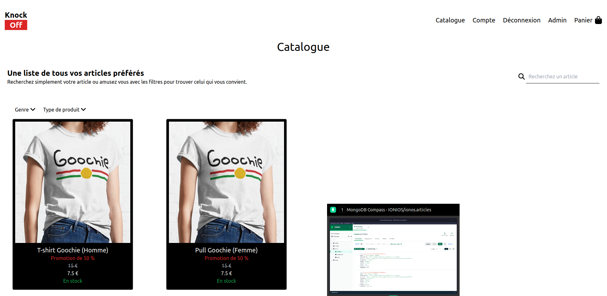
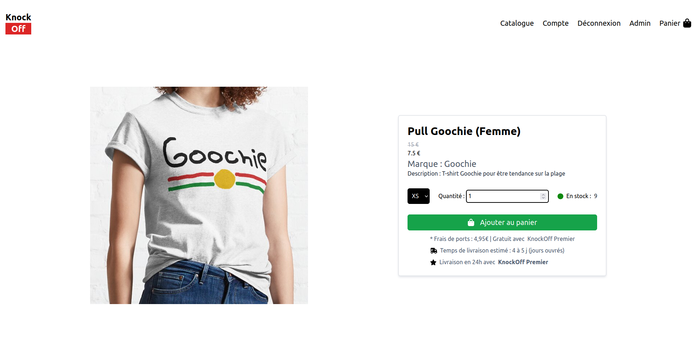
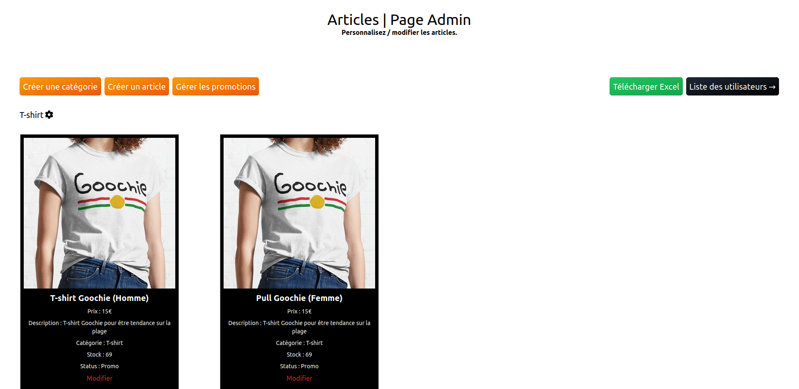

# E-Commerce

## Introduction

👋 Bienvenue !

Voici le projet de fin de première année à la Web@cadémie. Le but était de créer un site e-commerce en groupe et en utilisant les technologies de notre choix.
Il a donc été fait en groupe à 5 durant 1 mois.

## Fonctionnalités

- Voir les articles et les ajouter au panier
- Gestion des articles et des stocks (admin)
- Gestion des catégories (admin)
- Mettre en place des promotions uniques et générales (admin)
- Gestion des comptes utilisateurs (admin)
- Création d'un fichier Excel pour visualiser les stocks par article (admin)
- Payer sans être connecté
- Abonnement supprimant les frais de port

## Captures d'écran

